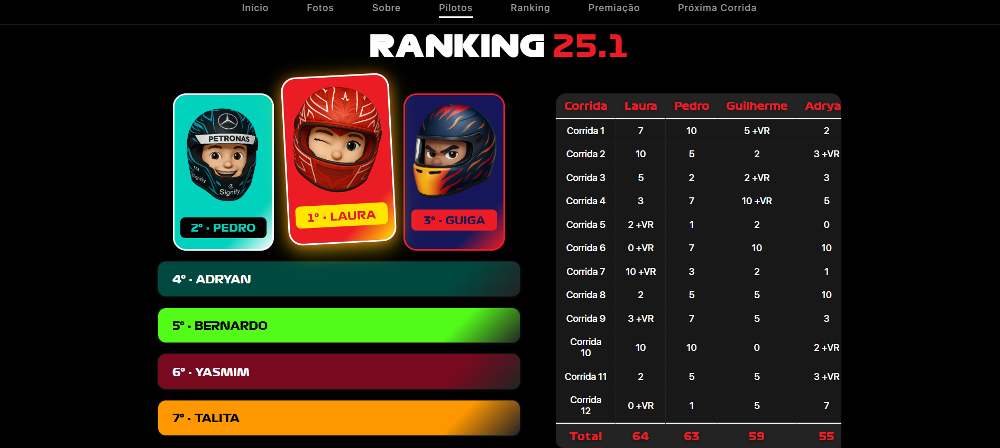
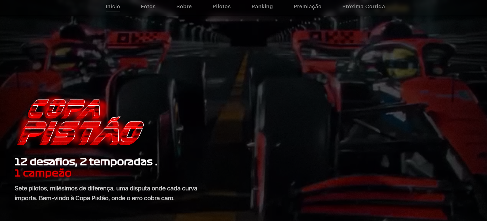

  

# 🏁 Copa Pistão
**12 desafios. 2 temporadas. 1 campeão.**  

🔗 [Acesse aqui](https://copapistao.surge.sh/)  
⚠️ **Melhor visualização no computador – responsividade ainda em desenvolvimento.**

---

## git add README.md
Interface do Projeto

### 🏆 Ranking dos Pilotos

### 🏎️ Página Inicial

---

## 🛠️ Tecnologias Utilizadas
- 
- 
- 

---

## 📌 Observações
- Projeto real desenvolvido para a competição de kart Copa Pistão, organizada entre amigos
- nterface e funcionalidades pensadas para facilitar o acompanhamento das corridas, pontuação e evolução dos pilotos
- Layout mobile será otimizado em breve

