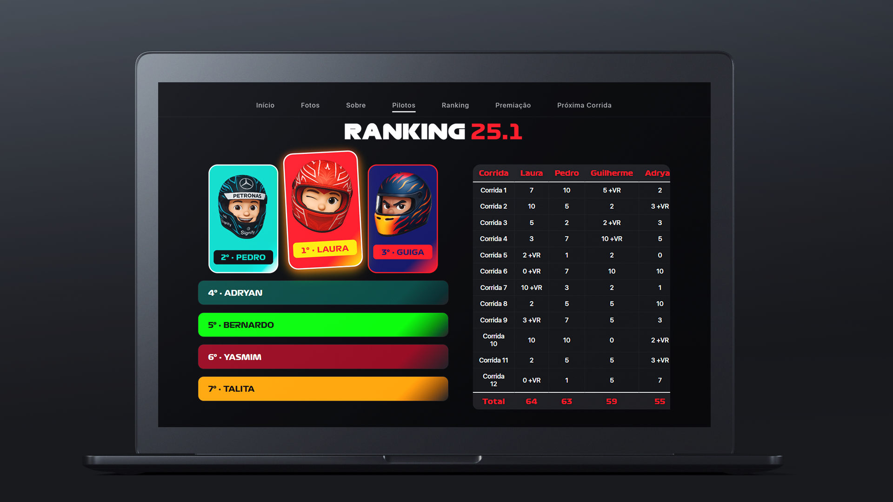

  

# 🏁 Copa Pistão
**12 desafios. 2 temporadas. 1 campeão.**  
Milésimos de segundo fazem diferença. Aqui, o erro cobra caro.

🔗 [Acesseaqui](https://copapistao.surge.sh/)  
⚠️ **Melhor visualização no computador – responsividade ainda em desenvolvimento.**

---

## 📸 Interface do Projeto

### 🏆 Ranking dos Pilotos

### 🏎️ Página Inicial

---

## 🛠️ Tecnologias Utilizadas
- HTML5 + CSS3
- JavaScript Vanilla
- Surge.sh (deploy gratuito)

---

## 📌 Observações
- Projeto em desenvolvimento com foco em **experiência visual**
- Todos os dados são fictícios e ilustrativos
- Layout mobile será otimizado em breve

---

Feito com 🏎️ e 💻 por [pedrosoares0](https://github.com/pedrosoares0)

